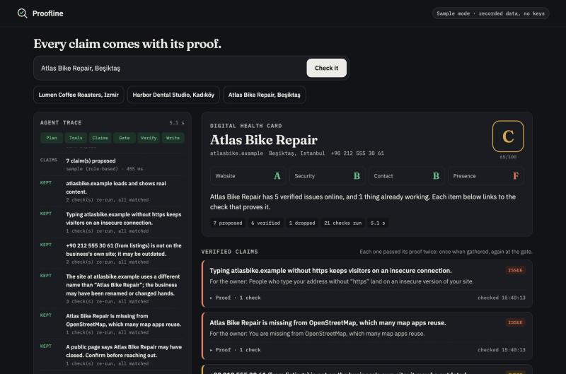
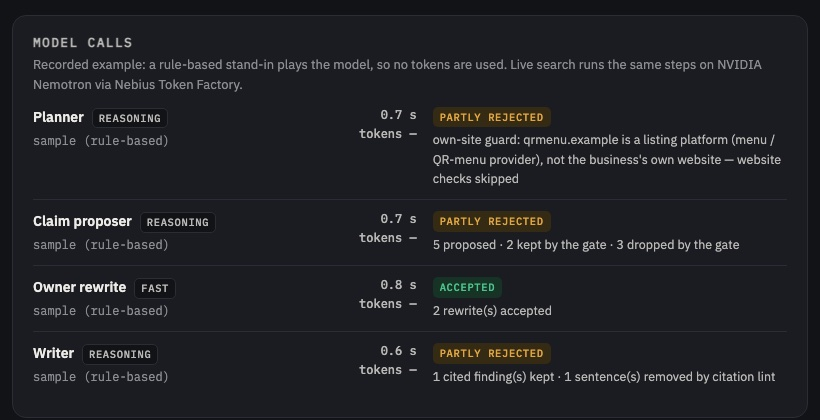

# Proofline

**Proofline is an agent for people who sell web services to small businesses: it researches a business from its public web traces, lets NVIDIA Nemotron propose what is true, then re-checks every claim with code, so a stale or invented "fact" never reaches the sales call.**

**Live demo: <https://proofline-demo.dwelltime-yayin.workers.dev>** · Code (MIT): <https://github.com/jpalii77/proofline>

### Try it in 30 seconds

1. Open the demo. No sign-up, no key.
2. Click the recorded example **Kuzey Kafe**.
3. Watch the trace: the model mistakes a QR-menu page for the café's website, and **the proof gate drops the three claims made against it**, struck through, with the reason.
4. Open **Proof** under any claim and press **Re-run proof**: its checks run again, right now.
5. Optional: press **How it works (30 s)** for a four-step guided tour, or switch the interface to **TR**.



> Built for the Nebius × NVIDIA Global AI Hackathon, track **Best Apps and Agents**.

---

## Contents

- [The problem](#the-problem)
- [How Proofline uses Nebius Token Factory and NVIDIA Nemotron](#how-proofline-uses-nebius-token-factory-and-nvidia-nemotron)
- [How it uses Tavily](#how-it-uses-tavily)
- [The proof gate](#the-proof-gate)
- [Design for first-time users](#design-for-first-time-users)
- [Accuracy](#accuracy)
- [Setup](#setup)
- [Architecture](#architecture)
- [Tests](#tests)
- [Reference](#reference): checks, claims, failures, public demo limits, Workers notes
- [License](#license)

## The problem

Agencies and freelancers who sell web services to small businesses research each business before they call, more and more with AI agents. The agents repeat stale data with full confidence:

- "Their site is down": it loads fine; an old review said so.
- The phone number in a directory belongs to the previous owner.
- The business was renamed or changed hands; the old listing still ranks.
- The page the agent calls "their website" is actually a QR-menu or delivery platform.

A seller who repeats one of these to the owner loses the call in the first sentence. Proofline's rule: **the model may propose, only evidence may decide.**

## How Proofline uses Nebius Token Factory and NVIDIA Nemotron

Every model call goes, at runtime, to **Nebius Token Factory's OpenAI-compatible Chat Completions API** (`https://api.tokenfactory.nebius.com/v1/chat/completions`) with plain `fetch`, no SDK ([`src/llm.mjs`](src/llm.mjs)). Prompts are in [`src/agent/nemotron-brain.mjs`](src/agent/nemotron-brain.mjs); the roles are defined in `MODEL_ROLES` in [`src/agent/pipeline.mjs`](src/agent/pipeline.mjs).

| Role | Tier | Model (public demo) | What it does | What code does with the answer |
| --- | --- | --- | --- | --- |
| Planner | reasoning | `nvidia/nemotron-3-super-120b-a12b` | Picks which domain and phone belong to the business from noisy search results | Grounding guard: a domain or phone not found in the search results is removed |
| Claim proposer | reasoning | same | Maps observations to claims from a fixed catalog, with a rationale | Every claim goes to the proof gate |
| Owner rewrite | fast | `nvidia/NVIDIA-Nemotron-3-Nano-30B-A3B` | One plain sentence per verified claim, for the owner | A rewrite that adds a number not in the evidence is rejected (`numbersGrounded`) |
| Writer | reasoning | Super | Owner summary and a short pitch draft | Citation lint: a finding with no citation, or citing a dropped claim, is removed |

**Why two tiers.** The decisions that need judgement (who is this business, which claims follow from the evidence, how to explain them) go to the reasoning model, Nemotron 3 Super. The many short rewrites go to Nemotron 3 Nano, which is fast and cheap, and whose output is checked by a simple rule, so a small model's mistake cannot reach the owner. The tiers are set with `NEBIUS_REASONING_MODEL` and `NEBIUS_FAST_MODEL`; `npm run models` lists the Nemotron IDs on your key.

All calls ask for strict JSON (`response_format: json_object`); replies with `<think>` blocks or code fences are tolerated.

### The model calls panel

Every report has a panel that lists each Nemotron call of that run:

- role and tier (reasoning / fast) and the exact model ID;
- latency;
- tokens in / out (and reasoning tokens when present), read from the response's `usage` field by `parseUsage` in [`src/llm.mjs`](src/llm.mjs). A missing field is shown as unknown, never estimated;
- the outcome of code's checks on the answer: **accepted**, **partly rejected** (for example a Nano rewrite that introduced a number), **rejected**, or **no answer** (with the reason).

A summary line reads "N model calls · X tokens · Y claims dropped by the gate". The recorded examples use a rule-based stand-in instead of the model, so their panel says "no tokens".



## How it uses Tavily

[`src/tavily.mjs`](src/tavily.mjs) calls `POST https://api.tavily.com/search` **at runtime** in live mode. In the current code it is used for:

1. **Discovery** ([`src/agent/pipeline.mjs`](src/agent/pipeline.mjs)): one search for the business name and city. These results are the **only** source the planner may take a domain or phone from; anything the model names that is not in them is dropped.
2. **Own-site identity** (`site.own_site` and `web.own_site_found` in [`src/checks.mjs`](src/checks.mjs)): the same discovery results decide whether a domain is the business's own website (a search result about the business must point at it when the homepage alone does not name the business), and whether the business has a website of its own at all or only listings. A name alone is not enough when a city is known: the site or a search result showing it must name that city too, so a namesake abroad is never taken for the shop. Before "no website", the address built from the name (`name.com`, `name.com.tr`) is tried and counts only if its homepage names the business.
3. **Closure check** (`web.no_closure_signal`): `"<name>" <city> permanently closed`. A hit counts only if the same result also names the business.

Within one phase a repeated search is answered from memory, but the proof gate uses fresh I/O, so search-based claims are re-proven with a new Tavily call.

**Planned (not in the code yet):** a relocation / "moved" signal next to the closure check, and a dedicated identity-verification search.

## The proof gate

The idea in one line: **the model proposes, code re-proves every claim, and a claim that cannot be proven is dropped, in plain sight.**

- Claims can only come from a fixed catalog of 15 types ([`src/claims.mjs`](src/claims.mjs)). Each type names the evidence checks that prove it.
- The gate (`gateClaim`) re-runs those checks from scratch. A claim survives only if **every** check returns exactly what the claim needs. "Inconclusive" or "not checked" is not proof.
- Dropped claims stay on screen, struck through, with the check that failed. Nothing is hidden.
- Every website claim starts its proof with `site.own_site`, so a claim about a listing platform's page is dropped whatever the model proposed.
- "Site is down" needs a site that was shown to exist in the search results **and** two failed attempts. A timeout never becomes a finding.

This came from our own first live runs on 6 October 2026: the model picked a café's QR-menu page as "its website" and the gate kept six claims that were true only for the platform page. The fix went into the evidence and the gate, not into a longer prompt, and each failure now has a regression test. The fictional **Kuzey Kafe** sample replays that trap.

## Design for first-time users

The page is built for someone who has never heard of Proofline:

- **English and Turkish interface** ([`public/i18n.js`](public/i18n.js)): `?lang=tr|en`, then the saved choice, then the browser language, else English. The agent's own report text (claims, findings, drop reasons) is report data and stays in English for now.
- **Guided tour** ([`public/tour.js`](public/tour.js)): an optional four-step "How it works" tour (what this is, where to start, what the proof gate is, how to read the result). It never opens by itself; the button pulses once on a first visit. Esc closes, arrow keys move, reduced motion is respected.
- **Recorded examples first**: four fictional businesses run instantly and free; live search is one switch away.
- **Phone layout**: single-column layout below 880 px, compact grade card below 560 px.
- **Honest error states**: every failure has a plain sentence and a next step, never a stack trace. Examples: "Live quota used up today — try a recorded example", "The model service did not answer…", "The run stopped before it finished… Nothing was concluded from the checks that did not run." A server problem returns a plain message with HTTP 503, never a bare 500.
- **Share link**: each finished run gets a read-only link (`/r/<id>`, kept 14 days) that replays the same trace and report.

## Accuracy

> **Measurement in progress (Oct 2026).** The live agent is being run on a list of real businesses; every claim the gate keeps is then checked independently. Results will be published in [`docs/accuracy.md`](docs/accuracy.md). No numbers are shown until that check is done.

| Round | Date | Businesses | Claims proposed | Dropped by the gate | Kept | Kept and correct (independent check) | Accuracy of kept claims |
| --- | --- | --- | --- | --- | --- | --- | --- |
| 1 | — | — | — | — | — | — | — |

## Setup

Requires Node.js 20+. Zero dependencies, no `npm install` needed.

```bash
git clone https://github.com/jpalii77/proofline && cd proofline
npm run sample        # SAMPLE_MODE: recorded data, no keys, no network
# open http://localhost:8787
npm test              # node:test suites, no network
npm run cli:sample -- "Lumen Coffee Roasters, Izmir"   # same agent in the terminal
```

**Sample mode** runs the whole agent on four fictional businesses in [`fixtures/sample/`](fixtures/sample) (`.example` domains, TEST-NET addresses). The model is replaced by a deterministic rule-based stand-in with the same interface, labelled `sample (rule-based)` in the trace. Each sample plants one plausible-but-wrong claim so you can watch the gate drop it.

**Live mode** needs two keys in the environment (never commit them):

| Variable | Required | Default |
| --- | --- | --- |
| `NEBIUS_API_KEY` | yes | — |
| `TAVILY_API_KEY` | yes | — |
| `NEBIUS_BASE_URL` | no | `https://api.tokenfactory.nebius.com/v1/` |
| `NEBIUS_REASONING_MODEL` | no | `nvidia/nemotron-3-super-120b-a12b` |
| `NEBIUS_FAST_MODEL` | no | falls back to the reasoning model |
| `NOMINATIM_CONTACT` | recommended | — (identifies the app to OpenStreetMap) |
| `SAMPLE_MODE` | no | `false`. Live mode never falls back to samples silently: a missing key stops it with a message naming the key |
| `PORT` | no | `8787` |

```bash
NEBIUS_API_KEY=... TAVILY_API_KEY=... npm start
npm run models    # list Nemotron model IDs available to your key
```

Keys are read from the environment only. They are never logged, never sent to the browser; `/api/config` exposes only model names and the sample list.

## Architecture

The agent is one pipeline; every step streams to the browser as a trace event (Server-Sent Events).

1. **Intake**: parse the business name, city or domain.
2. **Discover**: Tavily search.
3. **Plan**: Nemotron 3 Super picks domain and phone; grounding and own-site guards remove anything not backed by the search results.
4. **Gather**: code runs up to 12 evidence checks (own-site identity, DNS, HTTPS, redirect, certificate, parked page, contact path, phone, name match, OpenStreetMap, closure search).
5. **Propose**: Nemotron 3 Super chooses claims from the catalog.
6. **Gate**: code re-runs each claim's proof from scratch; unproven claims are dropped with the reason.
7. **Verify wording**: Nemotron 3 Nano rewrites verified claims for the owner; rewrites with new numbers are rejected.
8. **Write**: Nemotron 3 Super writes the owner summary and the pitch; uncited findings are removed.
9. **Card**: code grades website, security, contact and presence from verified claims only.

Where it lives:

- `server.mjs`: local HTTP server (static UI, SSE trace, re-run proof, share links).
- `worker/index.mjs`: Cloudflare Workers entry and the `DemoState` Durable Object (SQLite-backed quotas, cache, share links).
- `src/agent/`: pipeline and guards, Nemotron prompts, sample stand-in, health-card grading.
- `src/checks.mjs`, `src/claims.mjs`: the 12 checks, the 15-claim catalog and the gate.
- `src/platforms.mjs`, `src/hostname.mjs`: listing-platform list; offline hostname and public-suffix check.
- `src/llm.mjs`, `src/tavily.mjs`: API clients (plain `fetch`), token usage parsing.
- `src/io/`: live DNS / HTTP / TLS / Nominatim / Tavily with an SSRF guard; Node and Workers network adapters; recorded I/O for sample mode.
- `src/limits.mjs`, `src/web/`: run time limit, plain error messages, demo API, share links.
- `public/`: single-page UI, no framework (`i18n.js`, `tour.js`, `gate.js`).

## Tests

**164 tests in 22 files, all passing** (`npm test`, Node's built-in `node:test`, no network). They cover the checks, the gate, own-site and hostname rules, model-call accounting, share links, the Workers network adapter, the public demo's quotas, the interface language and tour, and crash guards (odd input, broken services and malformed requests must never take the server down or show a stack trace).

## Reference

### Evidence checks

| Check | What it proves |
| --- | --- |
| `site.own_site` | The domain is the business's **own** website: a valid web address, not a listing platform, and its homepage names the business, or a search result about the business points at it |
| `web.own_site_found` | Some non-platform domain in the search results passes `site.own_site`. When none does, the business has listings only |
| `dns.resolves` | The domain has address records |
| `http.reachable` | The site answers over HTTPS — **two attempts**, so one timeout never becomes "site is down" |
| `http.https_redirect` | Plain `http://` upgrades to HTTPS |
| `tls.cert_valid` | Certificate is trusted and has at least N days left |
| `page.not_parked` | Homepage is real, not a for-sale / parking / placeholder page |
| `page.contact_path` | Form, email (link or plain text), phone (tap-to-call or labelled number) or WhatsApp link exists. On a page longer than the read limit, "none found" is "not checked" |
| `page.phone_listed` | A given phone number is on the business's own site (format-insensitive) |
| `page.name_match` | Site name matches the business name (a mismatch is the rename / change-of-hands signal) |
| `osm.listed` | A matching place exists on OpenStreetMap (Nominatim) |
| `web.no_closure_signal` | No search result names the business together with "permanently closed" (Tavily) |

### Claim catalog

`site_online`, `site_unreachable`, `domain_parked`, `https_healthy`, `ssl_expiring_soon`, `ssl_invalid`, `no_https_redirect`, `no_contact_path`, `phone_confirmed`, `phone_unconfirmed`, `no_own_website`, `on_map`, `not_on_map`, `possibly_closed`, `possibly_renamed` — each defined in [`src/claims.mjs`](src/claims.mjs) with its proof. `no_own_website` is also put to the gate by code when the evidence shows listings only.

### Own website vs. listings

A page about the business on a platform proves it is *present* there, never what "its website" has or lacks. [`src/platforms.mjs`](src/platforms.mjs) keeps a commented list of such hosts: menu / QR-menu providers, delivery apps, review and directory sites, booking, marketplaces, social networks and link hubs, maps. [`src/hostname.mjs`](src/hostname.mjs) rejects address abbreviations, @handles, emails, file names and IP addresses using an embedded offline public-suffix list.

### Recorded samples

| Sample | What the agent finds | Planted claim the gate drops |
| --- | --- | --- |
| Lumen Coffee Roasters | Certificate expires in 9 days, phone confirmed on its site | "Site is down" |
| Harbor Dental Studio | Domain shows a for-sale page; listed phone not on site | "Certificate invalid" |
| Atlas Bike Repair | Renamed site, closure signal, no HTTPS redirect; first request times out | "Phone confirmed" |
| Kuzey Kafe | No website of its own, only a QR-menu page and Instagram; the planner mistakes the menu platform for its site | "No contact path", "phone not on its site", "renamed" — all made against the platform page |

### When something fails

| Failure | What happens |
| --- | --- |
| A Nemotron call errors, times out or returns unreadable JSON | Shown as **no answer** with the reason; only that step degrades (no planner → code identifies the business from query and search; no proposer → only claims code can put to the gate itself; no rewrite → checked wording kept; no writer → no pitch). Nothing unproven is added |
| The run reaches its time limit (`LIVE_RUN_SECONDS`, default 90) | Remaining checks answer **not checked**, no new model call starts, the gate drops claims that depended on them |
| The host's request budget or Cloudflare's subrequest limit is hit | Same: **not checked**, never a finding |
| Tavily search fails | The run continues from the query; search-based checks are inconclusive |
| Anything unexpected on the server | A plain sentence and HTTP 503; if the stream is cut, the page says the run stopped and nothing was concluded |

A partial live run is shown but not cached.

### Public demo limits

The demo runs on **Cloudflare Workers** (free plan) and opens in recorded mode. Live search calls Tavily and Nemotron for real and is rate-limited to protect a small trial credit (Worker vars in [`wrangler.jsonc`](wrangler.jsonc)):

| Var | Default | Meaning |
| --- | --- | --- |
| `LIVE_GLOBAL_PER_DAY` | 20 | live runs per UTC day, all visitors together |
| `LIVE_IP_PER_DAY` | 3 | live runs per visitor per UTC day (salted, per-day IP hash; IPs are never stored) |
| `LIVE_CACHE_HOURS` | 24 | an identical query is answered from cache, without new API calls or quota |
| `LIVE_REQUEST_BUDGET` | 40 | outbound check requests per live run |
| `LIVE_RUN_SECONDS` | 90 | time limit for one live run |
| `LIVE_RECHECK_GLOBAL_PER_DAY` / `LIVE_RECHECK_IP_PER_DAY` | 100 / 15 | "Re-run proof" on live runs |
| `LIVE_ENABLED` | `true` | `false` switches live search off |

Host self-test (fixed public test hosts, no keys, no model calls): <https://proofline-demo.dwelltime-yayin.workers.dev/api/selftest>

### What differs on Workers

Workers have no system DNS resolver and no raw TLS peer-certificate API, so two checks gather the same evidence another way ([`src/io/net-worker.mjs`](src/io/net-worker.mjs); local Node uses [`src/io/net-node.mjs`](src/io/net-node.mjs)): `dns.resolves` uses DNS-over-HTTPS, and `tls.cert_valid` checks trust through Workers' own TLS client and reads expiry from Certificate Transparency logs. The evidence says so. On Workers an untrusted certificate is reported without the exact reason Node shows, and a CT expiry date can in rare cases differ from the certificate actually served.

### Safety and data

- Public business information only: website, DNS, certificate, map listing, search results. No personal profiles, no logins.
- SSRF guard: private, loopback and link-local addresses are refused on every redirect hop.
- Small, capped requests (8 s timeout, 400 KB body cap); Nominatim limited to 1 request per second with an identifying User-Agent.
- Proofline never sends messages. The pitch is a draft.

### Other hosts

The app is a single Node process with no dependencies, so any container host works (`node server.mjs`, `PORT`, keys as secrets). Only the Cloudflare Workers deployment is verified.

## License

[MIT](LICENSE)
