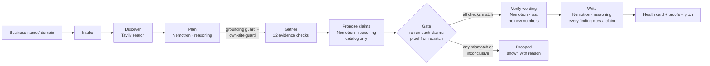

# Proofline

**An agent that builds a verified profile of a small business — and shows its receipts.**

Give Proofline a business name (or a domain). It collects the business's scattered web traces —
website, DNS, TLS certificate, redirects, OpenStreetMap, web search — and lets **NVIDIA Nemotron on
Nebius Token Factory** decide what is true. Then it does something most agents don't: **it re-checks
every claim with code before anyone sees it.** A claim whose proof fails is dropped, in plain sight.

The output is a plain-language **digital health card** for the owner and a short, **evidence-cited
pitch draft** for the person who wants to help them.


> Built for the Nebius × NVIDIA Global AI Hackathon (track: Best Apps and Agents).
> Status: first working version. Sample mode runs end to end; live mode is wired and tested against
> a fake network, and will be tried against the real APIs once keys are in place.

---

## The problem

Agencies and freelancers who sell web services to small businesses lose hours to wrong data:

- “Their site is down” — it loads fine; a stale review said so.
- The phone number in a directory belongs to the previous owner.
- The business was renamed or changed hands; the old listing still ranks.
- The domain lapsed and now shows a for-sale page.

An LLM that summarises search results repeats these errors confidently. A seller who repeats them
to the owner loses the deal in the first sentence.

Proofline's answer: **the model may propose, only evidence may decide.**

## How it works



| Step | Who decides | What code enforces |
| --- | --- | --- |
| Discover | Tavily web search (live API call) | Results become the *allowed* domains and phones |
| Plan | Nemotron (reasoning) picks the business's domain and phone | **Grounding guard:** a domain or phone not seen in the input or search results is removed. **Own-site guard:** a listing platform, or a domain that does not identify the business, is never treated as its website; website checks are skipped and “no own website” is reported instead |
| Gather | Code runs up to 12 checks | Short timeouts, retries, SSRF guard, Nominatim rate limit |
| Propose | Nemotron (reasoning) chooses claims | **Catalog only:** every claim type names the checks that prove it |
| Gate | Code | Re-observes from scratch. A claim survives only if every check returns exactly what the claim needs. Inconclusive = not proven |
| Verify | Nemotron (fast) rewrites claims for the owner | A rewrite that adds a number not in the evidence is rejected |
| Write | Nemotron (reasoning) writes summary + pitch | **Citation lint:** a finding without a citation, or citing a dropped claim, is removed |
| Card | Code | Deterministic grades per area from verified claims only |

Every step streams to the UI as a trace event, so you can watch *why* each line is true. Each claim
card has a **Re-run proof** button that runs its checks again, right now.

### Evidence checks

| Check | What it proves |
| --- | --- |
| `site.own_site` | The domain is the business's **own** website: not a listing platform (see below), and its homepage names the business (`og:site_name`, title, `<h1>` or body; Turkish letters, case and Kafe/Cafe/Café tolerated) or a search result about the business points at it. With `needSearchTie` only the search-result tie counts |
| `web.own_site_found` | Some non-platform domain in the search results passes `site.own_site`. When none does, the business has listings only |
| `dns.resolves` | The domain has address records |
| `http.reachable` | The site answers over HTTPS — **two attempts**, so one timeout never becomes “site is down” |
| `http.https_redirect` | Plain `http://` upgrades to HTTPS |
| `tls.cert_valid` | Certificate is trusted and has at least N days left |
| `page.not_parked` | Homepage is real, not a for-sale / parking / placeholder page |
| `page.contact_path` | Form, email, tap-to-call or WhatsApp link exists |
| `page.phone_listed` | A given phone number is on the business's own site (format-insensitive) |
| `page.name_match` | Site name matches the business name (same identity rule as `site.own_site`; a mismatch is the rename / change of hands signal) |
| `osm.listed` | A matching place exists on OpenStreetMap (Nominatim) |
| `web.no_closure_signal` | No search result names the business together with “permanently closed” (Tavily) |

### Own website vs. listings

A page about the business on a platform proves it is *present* there, never what “its website” has
or lacks. [`src/platforms.mjs`](src/platforms.mjs) keeps a plain, commented list of such hosts:
menu / QR-menu providers (menulio, …), delivery apps (yemeksepeti, getir, trendyol), review and
directory sites (tripadvisor, foursquare, yelp, zomato), booking (booking, airbnb), marketplaces
(sahibinden, armut, bionluk), social networks and link hubs (instagram, facebook, tiktok, x,
linktr.ee) and maps (google.\*, maps.app.goo.gl). A path on such a host (`platform.com/sakal-kafe`)
is a listing. Site builders (`*.wixsite.com`, `*.business.site`, …) count only when the subdomain
itself names the business.

Every claim about the website (`site_*`, `ssl_*`, `https_healthy`, `no_https_redirect`,
`no_contact_path`, `phone_*`, `possibly_renamed`) starts its proof with `site.own_site`, so the gate
drops it — with the reason, e.g. “menulio.com.tr is a listing platform … not the business's own
website” — whatever the model proposed. `possibly_renamed` additionally needs a search result that
ties the domain to the business: a different name on an unverified domain is somebody else's site,
not a rename.

### Claim catalog

`site_online`, `site_unreachable`, `domain_parked`, `https_healthy`, `ssl_expiring_soon`,
`ssl_invalid`, `no_https_redirect`, `no_contact_path`, `phone_confirmed`, `phone_unconfirmed`,
`no_own_website`, `on_map`, `not_on_map`, `possibly_closed`, `possibly_renamed` — each defined in
[`src/claims.mjs`](src/claims.mjs) with its proof. `no_own_website` is also put to the gate by code
when the evidence shows listings only, even if the model did not propose it.

## Where NVIDIA Nemotron and Nebius Token Factory are used

All model calls go to **Nebius Token Factory's OpenAI-compatible Chat Completions API**
(`https://api.tokenfactory.nebius.com/v1/chat/completions`) — see [`src/llm.mjs`](src/llm.mjs)
and the prompts in [`src/agent/nemotron-brain.mjs`](src/agent/nemotron-brain.mjs).

| Role | Tier | Default model | Why |
| --- | --- | --- | --- |
| Planner | reasoning | `nvidia/nemotron-3-super-120b-a12b` | Disambiguate the business from noisy search results |
| Claim proposer | reasoning | same | Map the observations to catalog claims, with rationale |
| Verifier | fast | `NEBIUS_FAST_MODEL` (e.g. a Nemotron Nano ID) | Cheap, many short rewrites |
| Writer | reasoning | same as planner | Owner summary + cited pitch |

All calls ask for strict JSON (`response_format: json_object`); replies with `<think>` blocks or code
fences are tolerated. The default reasoning model ID is taken from Nebius's Nemotron page. Run
`npm run models` with your key to list the exact Nemotron IDs (Nano / Super / Ultra) on your account
and set them via environment variables.

## Where Tavily is used

[`src/tavily.mjs`](src/tavily.mjs) calls `POST https://api.tavily.com/search` **at runtime**, twice
per run:

1. **Discover** — find the business's site, listings and phone. These results are the only source
   the planner may pick a domain or phone from.
2. **Closure check** — `"<name>" <city> permanently closed`; a hit only counts if the same result
   also names the business.

## Quick start

Requires Node.js 20+ (no `npm install` needed — zero dependencies).

```bash
git clone <this repo> proofline && cd proofline
npm run sample        # SAMPLE_MODE: recorded data, no keys, no network
# open http://localhost:8787
npm test              # node:test suites, no network
npm run cli:sample -- "Lumen Coffee Roasters, Izmir"   # same agent in the terminal
```

### SAMPLE_MODE

With `SAMPLE_MODE=true` the app runs end to end on four
**fictional** businesses recorded in [`fixtures/sample/`](fixtures/sample) (`.example` domains,
TEST-NET addresses). The model is replaced by a deterministic rule-based stand-in with the same
interface, clearly labelled `sample (rule-based)` in the trace.

Each sample plants one plausible-but-wrong claim (from a stale review or forum post) so you can watch
the gate drop it:

| Sample | What the agent finds | Planted claim the gate drops |
| --- | --- | --- |
| Lumen Coffee Roasters | Certificate expires in 9 days, no contact path, phone confirmed | “Site is down” |
| Harbor Dental Studio | Domain shows a for-sale page; listed phone not on site | “Certificate invalid” |
| Atlas Bike Repair | Renamed site, closure signal, no HTTPS redirect; first request times out | “Phone confirmed” |
| Kuzey Kafe | No website of its own, only a QR-menu page and Instagram; the planner mistakes the menu platform for its site | “No contact path”, “phone not on its site”, “renamed” — all made against the platform page |

### Live mode

Set these environment variables (for example in a local env file loaded with
`node --env-file=<file> server.mjs`; never commit it):

| Variable | Required | Default |
| --- | --- | --- |
| `NEBIUS_API_KEY` | yes | — |
| `TAVILY_API_KEY` | yes | — |
| `NEBIUS_BASE_URL` | no | `https://api.tokenfactory.nebius.com/v1/` |
| `NEBIUS_REASONING_MODEL` | no | `nvidia/nemotron-3-super-120b-a12b` |
| `NEBIUS_FAST_MODEL` | no | falls back to the reasoning model |
| `NOMINATIM_CONTACT` | recommended | — (identifies the app to OpenStreetMap) |
| `SAMPLE_MODE` | no | `false`. Live mode never falls back to samples silently: if a key is missing it refuses to start and says which one |
| `PORT` | no | `8787` |

```bash
NEBIUS_API_KEY=... TAVILY_API_KEY=... npm start
npm run models    # list Nemotron model IDs available to your key
```

Keys are read from the environment only. They are never logged, never sent to the browser, and
`/api/config` exposes only model names and the sample list.

## Safety and data

- Reads **public business information only**: website, DNS, certificate, map listing, search results.
  No personal profiles, no logins, no scraping behind auth.
- **SSRF guard:** refuses to fetch private, loopback or link-local addresses, on every redirect hop.
- Small, capped requests (8 s timeout, 400 KB body cap); Nominatim limited to 1 request/second
  with an identifying User-Agent, per its usage policy.
- Never sends messages. The pitch is a draft.

## Project layout

```
server.mjs                 HTTP server: static UI, SSE trace stream, re-run proof endpoint
src/agent/pipeline.mjs     the agent loop and all guards
src/agent/nemotron-brain.mjs   prompts for Nemotron on Token Factory
src/agent/sample-brain.mjs     deterministic stand-in for SAMPLE_MODE
src/agent/card.mjs         health-card grading
src/checks.mjs             the 12 evidence checks
src/platforms.mjs          listing / social / directory hosts that are never an own website
src/claims.mjs             claim catalog + gate
src/io/real.mjs            live DNS / HTTP / TLS / Nominatim / Tavily, SSRF guard
src/io/sample.mjs          recorded I/O for SAMPLE_MODE
src/llm.mjs, src/tavily.mjs    API clients (plain fetch, no SDK)
public/                    single-page UI (no framework)
tests/                     node:test suites
```

## Deployment (planned)

The app is a single Node process with no dependencies, so any container host works.

```Dockerfile
FROM node:22-alpine
WORKDIR /app
COPY . .
ENV PORT=8080
EXPOSE 8080
CMD ["node", "server.mjs"]
```

- **Nebius Serverless Endpoints:** build and push the image above to a registry, create an endpoint
  from it with `PORT=8080`, and pass `NEBIUS_API_KEY` / `TAVILY_API_KEY` as secrets.
- **Any VM:** `node server.mjs` behind a reverse proxy with TLS.

Not yet deployed; steps will be verified before submission.

## Roadmap

- Record real Nemotron outputs for the sample fixtures (replacing the rule-based stand-in).
- More checks: social profile liveness, structured data (schema.org) consistency, Google-free
  opening-hours cross-check.
- Owner-facing card in Turkish and English.
- Batch mode for a seller's lead list.

## License

[MIT](LICENSE)
